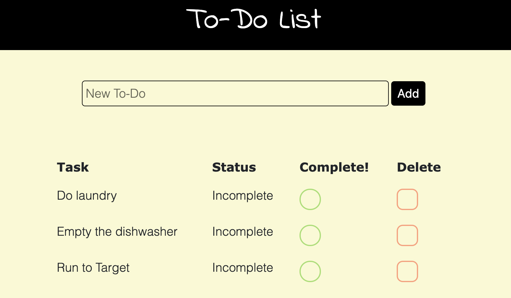

# To-Do List

## Description

Create your to-do list!  A user should be able to type a new task in the input.  When they click Add, it should update in the database.  The data from the database is being displayed in the table on the page.  There should be a button to "check off" an item, and there should be a button to delete the item.  The database is to reflect anything that the user does.

## Screenshot

## Prerequisites

* Node.js
* Postgres

## Installation

1. Create a database named weekend-to-do-app
1. You will see the neccessary queries in database.sql.  Make sure you have Postgres installed!  We also used Postico to run those queries.
1. Open in editor of your choice
1. Open terminal and run npm install express
1. Run npm install pg
1. Run node server/server.js in your terminal
1. Open up a browser
1. Visit http://localhost:5000

## Usage

You should be able to create your to-do list.

1. Type your new task in the input
1. Click Add
1. See your new task appear in the table
1. Click the green circle to complete the item
1. Click the red square to delete the item

## Built With

* Node.js
* Express
* Postgres
* jQuery
* HTML
* CSS

## Acknowledgement

Thanks to Prime Digital Academy who equipped and helped me to make this application a reality.

## Support

If you have any questions or issues, please email me at baileyniemiller@gmail.com
